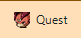
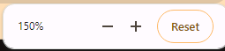
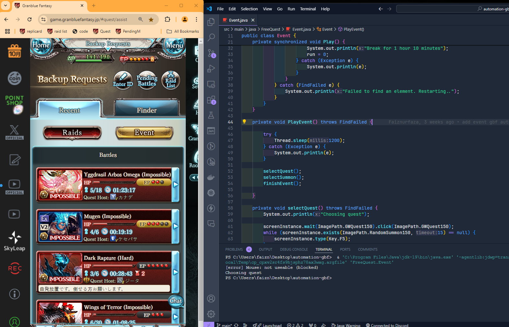

# Automation Tools GBF

## Table of Contents

- [Automation Tools GBF](#automation-tools-gbf)
  - [Table of Contents](#table-of-contents)
  - [Description](#description)
  - [Prerequisites](#prerequisites)
  - [Installation](#installation)
  - [Usage](#usage)
  - [Notes](#notes)
  - [License](#license)

## Description

This is my personal Automation tools for [Granblue Fantasy](http://game.granbluefantasy.jp) web browser game.

## Prerequisites

- Windows
- JRE 8 or higher
- JDK 18 or higher

## Installation

1. Clone the repository:

   ```sh
   git clone https://github.com/Faiznurfaza/automation-tools-gbf.git
   cd automation-tools-gbf
   ```

2. Build the project using Maven:
   ```sh
   ./mvnw clean install
   ```

## Usage

To use this automation tool:

1. Open a file from `src/main/java/FreeQuest` or `src/main/java/Raid`
2. For example, if you open `Event.java`, you might see something like this :
   
   the `GWQuest150` image should look like this :
   
3. Add a bookmark bar in your browser tab. Press `CTRL+SHIFT+B` in Chrome to show the bookmark bar:
   
4. Zoom in the browser to 150% and minimize until it looks like this
   
   
5. In your IDE, run the Java file and let the program automate the task for you.

## Notes

- In some files, the program will run endlessly until a captcha appears
- Some will run until a specified number of repetitions.

## License

This project is licensed under the MIT License.
